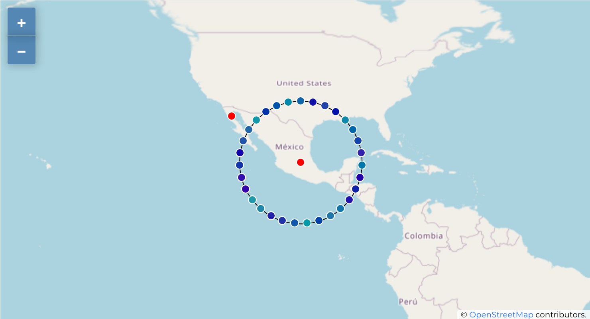
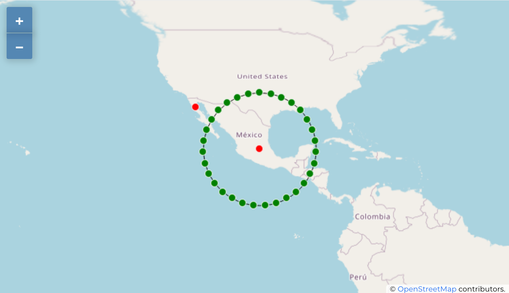
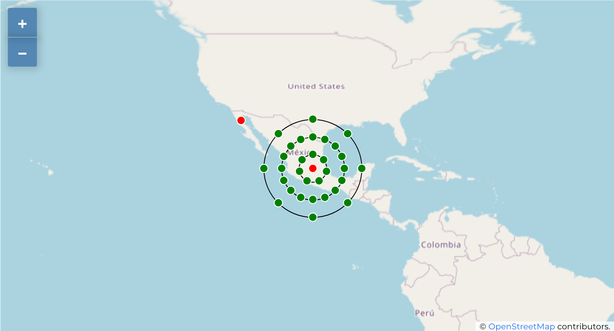
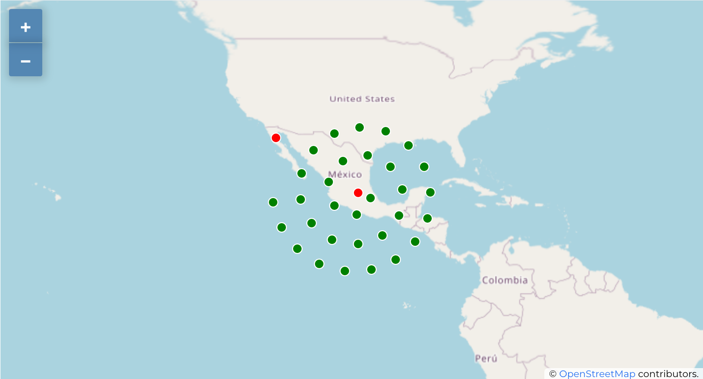
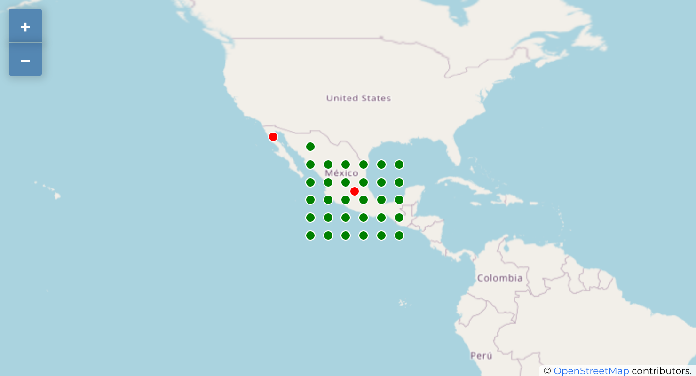

# Point displacement

Point Displacement methodology works to visualize all features of a point layer, even if they have the same location. To do this, the map takes the points falling in a given Distance tolerance from each other (cluster) and places them around their barycenter following different Placement methods:

- [**Ring**](#grid): Places all the features on a circle whose radius depends on the number of features to display.
- [**Concentric Rings**](#concentric-rings)): Uses a set of concentric circles to show the features.
- [**Spiral**](#spiral)): Creates a spiral with the features farthest from the center of the group in each turn.
- [**Grid**](#grid)): Generates a regular grid with a point symbol at each intersection.

> Note: Point Displacement methodology does not alter feature geometry, meaning that points are not moved from their position. Changes are only visual, for rendering purpose. Each barycenter is themselves a cluster with an attribute features that contain the original features.

## Install

## npm

```npm
npm i circle-properties
```

## Usage

[Example CodeSandbox](https://codesandbox.io/s/ol-displaced-points-twijp1)

```html
<!DOCTYPE html>
<html>
  <head>
    <title>Displaced Points</title>
    <meta charset="UTF-8" />

    <style>
      .map {
        width: 100%;
        height: 400px;
      }
    </style>
  </head>

  <body>
    <div id="map" class="map" />

    <script src="src/index.js"></script>
  </body>
</html>
```

```javascript
import Map from "ol/Map";
import TileLayer from "ol/layer/Tile";
import OSM from "ol/source/OSM";
import VectorLayer from "ol/layer/Vector";
import View from "ol/View";
import VectorSource from "ol/source/Vector";
import GeoJSON from "ol/format/GeoJSON";

import DisplacedPoints from "ol-displaced-points";

const sourceDisplacedPoints = new DisplacedPoints({
  source: new VectorSource({
    url: "./features.geojson",
    format: new GeoJSON(),
  }),
  distance: 80,
  minDistance: 40,
});

new Map({
  layers: [
    new TileLayer({ source: new OSM() }),
    new VectorLayer({
      source: sourceDisplacedPoints,
      style: styleDisplacedPoints,
    }),
  ],
  target: "map",
  view: new View({
    center: [-101.012614352653245, 20.905432044070093],
    zoom: 3,
    projection: "EPSG:4326",
  }),
});
```


### Style options

```javascript
...
import { Circle, Fill, Stroke, Style } from "ol/style";

const radioPuntos = 5;
const radioCentro = 5;
const sourceDisplacedPoints = new DisplacedPoints({
  source: new VectorSource({
    url: "./features.geojson",
    format: new GeoJSON(),
  }),
  distance: 80,
  minDistance: 40,
  radioCenterPoint: radioCentro,
  radioDisplacedPoints: radioPuntos,
});


function styleCircle(radius, stroke, fill = "#0000") {
  return new Style({
    image: new Circle({
      radius: radius,
      stroke: new Stroke({
        color: stroke,
        with: 1,
      }),
      fill: new Fill({
        color: fill,
      }),
    }),
  });
}

function styleDisplacedPoints(f) {
  if (f.get("anillo")) {
    return styleCircle(f.get("anillo").radius);
  }
  if (f.get("features")) {
    return styleCircle(radioCentro, "white", "red");
  }

  return styleCircle(radioPuntos, "white", `#${f.get("cvegeo")}a`);
}

new Map({
  layers: [
    new TileLayer({ source: new OSM() }),
    new VectorLayer({
      source: sourceDisplacedPoints,
      style: styleDisplacedPoints,
    }),
  ],
  ...
});
```



### Placement methods

#### Ring

```javascript
const sourceDisplacedPoints = new DisplacedPoints({
  ...
  placementMethod: "ring" // default
});
```



#### Concentric Rings

```javascript
export const sourceDisplacedPoints = new DisplacedPoints({
  ...
  placementMethod: "concentric-rings"
});
```



#### Spiral

```javascript
export const sourceDisplacedPoints = new DisplacedPoints({
  ...
  placementMethod: "spiral"
});
```



#### Grid

```javascript
export const sourceDisplacedPoints = new DisplacedPoints({
  ...
  placementMethod: "grid"
});
```



### distance between points

## Attribution

[Qgis Point displacement renderer](https://docs.qgis.org/3.22/en/docs/user_manual/working_with_vector/vector_properties.html#point-displacement-renderer)

[ol-ext: SelectCluster](http://viglino.github.io/ol-ext/examples/animation/map.animatedcluster.html)
